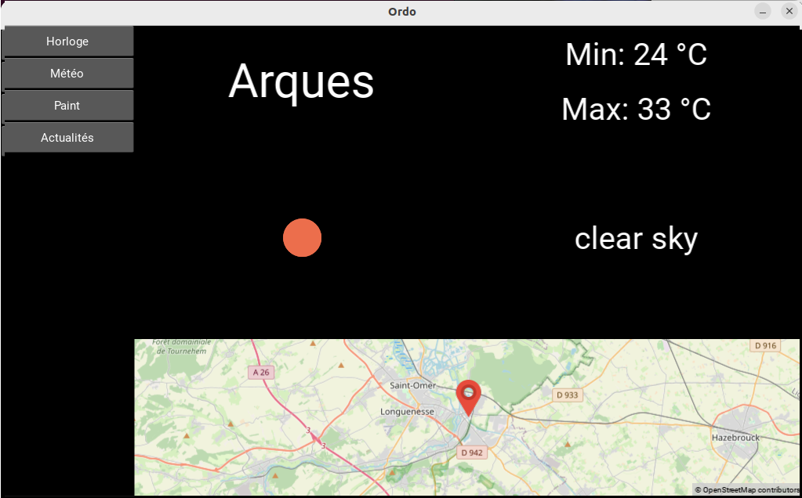

# Ordo_meteo

Application Ordo permettant d'afficher la météo de la ville de votre choix. Si vous restez sur cet écran, la météo est mise à jour toutes les 30 minutes.

Pour l'utiliser, vous aurez besoin de mapview pour afficher la carte géographique ainsi qu'un compte sur https://openweathermap.org/ pour obtenir une clé API.

Une fois cela fait, vous pouvez créer un fichier sous le nom de meteo.json dans le dossier parameters de votre application Ordo et y ajouter ceci : 

```
{
    "openweather_api_key": "votre_cle_api", 
    "openweather_api_city": "Le nom de votre ville"
}
```



## Ajouter l'application

Sur Ordo, déposer ce dossier dans "plugins" dans votre application Ordo.

Puis, sur parameters/ordo.json, ajouter Ordo_clock de cette manière : 

```
{
    "plugins" : ["ordo_meteo"]
}
```